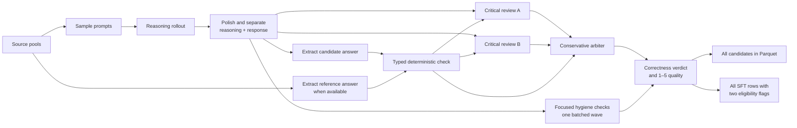

# Pipeline design

This document describes how a prompt becomes an auditable SFT row. The current direction is to
test whether filtering **unproductive reasoning** from math/reasoning SFT improves the starting
policy and early RL efficiency. The design keeps training text natural while evaluating
correctness, completion, and reasoning productivity separately. It does not assume that shorter
reasoning is inherently better: a long trace should pass when its steps make progress and finish.

## End-to-end flow



Every rollout reaches both outputs. Nothing is removed by top-k selection. Broken or confirmed
incorrect generations receive score `0`; uncertain cases remain present with an explicit verdict.
The two eligibility flags support the matched correctness-only and productivity-filtered SFT
comparison without silently deleting any rollout.

At a glance, the data and the quality evidence remain separate:

```text
prompt ──► scratch solution ──► clean reasoning + response ─────────► SFT text
                                      │
                                      └──► extracted answer
                                               │
source answer ──► extracted reference ─────────┼──► exact check ─┐
                                               │                 ├──► final verdict + score
clean reasoning + response ──► two critical reviews ─────────────┤
clean reasoning + response ──► focused hygiene checks ────────────┘

                correctness-only and productivity-filtered flags; no row is dropped
```

## What the model produces

The initial call uses thinking mode and the configured effort and token budget. A deterministic
polish call then turns the scratch work into two natural-text fields:

- `reasoning`: a clean derivation suitable for training;
- `response`: the final answer presented to the user.

The pipeline does not require the response to contain `\boxed{}`, XML tags, or pipeline-specific
tokens. Those conventions would leak an artificial template into training data and still would not
solve malformed-reference or multi-answer verification.

Long inputs are budgeted before polishing. If the full scratch trace would leave no output space,
the pipeline preserves its beginning and end and marks the omitted middle. The original draft is
still retained in the candidates dataset.

## Batched quality waves

All waves run through the already-loaded model actor when the judge uses the teacher model. They
are batched across rows; there is no model reload between phases. A different judge model can be
configured later without changing the output contract.

### Wave 1: answer extraction

Candidate and reference extractions are submitted together in one batch. Both use constrained JSON.

The candidate extractor sees only the question and final response. It never sees the reasoning or
reference, so it cannot copy the expected answer or be persuaded by the derivation. The reference
extractor independently sees only the question and source answer.

For a short, atomic source answer such as `2020`, a conservative local fallback recovers the token
if the model incorrectly labels it absent. It borrows only the candidate's broad answer kind and
never changes either value; long explanations and multi-answer references still defer to review.

An extraction records:

```json
{
  "status": "extracted",
  "answer_type": "expression",
  "value": "5\\sqrt{5}",
  "values": [],
  "unit": null,
  "evidence": "5\\sqrt{5}"
}
```

The extracted candidate is stored in `answer_json`. This is operational metadata, not part of the
assistant response used for training.

### Deterministic verification

The checker is selected from the extracted answer type:

| Answer kind | Check |
|---|---|
| number, expression, equation | normalized symbolic equivalence |
| set or multiple answers | equal cardinality plus one-to-one symbolic equivalence |
| Boolean or choice | normalized exact match |
| Reasoning Gym task | the task's native scorer |
| code with an environment | execution and test cases when supplied by the source |
| free text or proof | no forced deterministic decision; defer to critical review |

Candidate and source mathematics are wrapped in an internal LaTeX environment only after
extraction. This gives `math-verify` clear boundaries without changing the SFT response. Parse
failure, unsupported answer type, or missing unit is `indeterminate`, not `incorrect`.

### Wave 2: independent critical reviews

Two reviews are sampled in parallel in one model call. Thinking is enabled. Each reviewer must:

1. establish final-answer correctness without trusting the candidate's reasoning;
2. try counterexamples and boundary cases;
3. check that the question is internally consistent and sufficiently specified;
4. locate the earliest material reasoning defect;
5. treat the source reference as strong but fallible evidence;
6. report concrete defects rather than summarize the solution.

An impossible or underdetermined prompt is not automatically bad SFT data: a response that clearly
identifies the defect can still be excellent. A response that notices the defect and then invents
assumptions to force a numerical answer is incorrect.

The number of parallel reviews, their effort, and their token budget are configured under
`quality.judge`. Raw reviews remain in `critic_analyses_json` in the candidates dataset.

### Wave 3: arbitration

A final constrained-output call reads both reviews, the deterministic result, the candidate, and
the reference. It confirms or rejects alleged defects and returns three independent assessments:

- answer correctness and confidence;
- reasoning quality from 1–5;
- response quality from 1–5.

The lower of reasoning and response quality is the raw quality score. This means a polished final
answer cannot hide an invalid derivation, and a good derivation cannot excuse a wrong user-facing
answer.

### Wave 4: focused trajectory hygiene

Four narrow semantic requests per candidate are submitted together in one batched call. Each
checks **one** failure: repeated steps, circular re-checking, continuation without new progress,
or an unresolved contradiction/abandoned branch. The initial reviewer is the configured Qwen
judge; a cross-family judge can be substituted if manual calibration exposes false negatives.

Each check returns `defect`, `clear`, or `uncertain`, plus a concise explanation. A claimed defect
must quote exact text from the stored reasoning; unanchored claims become uncertain and are
recorded as judge errors. If context had to be truncated, a `clear` verdict becomes uncertain
because the omitted middle was not inspected. A repeated-span signal is computed locally and
shown to the repetition reviewer; only an extreme, long repeated span is an automatic defect.

Two further checks are deterministic: whether generation stopped at the token limit, and whether
the separate final answer is absent, ambiguous, or unextractable. The final-answer check does not
pretend an extractor failure proves the answer wrong; it records uncertainty. All six findings,
including evidence and errors, are in `quality_details_json.hygiene`.

Productivity does **not** mean universally short output. Necessary exploration, one useful
independent check, and explicit self-correction should pass. Length should fit the problem; the
filter targets work that repeatedly consumes tokens without advancing a solution.

## Correctness verdicts

`correctness_verdict` is deliberately separate from `quality_score`:

| Verdict | Meaning |
|---|---|
| `verified` | deterministic check passed and the critical review agrees |
| `supported` | no decisive deterministic check exists, but the critical review independently supports the answer with high confidence |
| `incorrect` | incorrectness was confirmed with high confidence |
| `conflict` | deterministic and model evidence disagree, or the reference appears defective |
| `indeterminate` | available evidence cannot settle correctness |

A deterministic pass is not overturned by an unsupported model objection; that becomes a conflict.
A deterministic mismatch is also not blindly trusted when the reviewers establish mathematical
equivalence or a bad reference.

## Score semantics

| Score | Meaning |
|---:|---|
| `5` | training-ready: correct, rigorous, concise, self-contained, and needs no edit |
| `4` | fully correct; one minor edit would improve clarity or style |
| `3` | mostly correct but requires a substantive local repair |
| `2` | useful progress, but a major rewrite is required |
| `1` | unusable without replacement |
| `0` | broken generation, failed quality machinery, or confirmed incorrect answer |

Known-answer conflicts and indeterminate verification are capped at `3`. A confirmed material
hygiene defect caps quality at `2`; uncertain hygiene caps it at `3`. Missing judge output or
unanchored claimed evidence is a judge error and scores `0`, not mathematical incorrectness.
All caps and zero reasons are explicit in `quality_details_json`.

## Selection for the matched SFT comparison

Both selection rules require a complete generation, an extracted final answer, and a `verified`
or high-confidence `supported` correctness verdict. The productivity-filtered rule additionally
requires all six hygiene checks to pass. An indeterminate check is excluded from this strict
selection but retained for review; it is not silently treated as a confirmed failure.

`correctness_only_eligible`, `productivity_filtered_eligible`, `hygiene_status`, and
`exclusion_reasons_json` are top-level SFT columns. The same information and per-category evidence
live in `quality_details_json`. This makes the control and treatment selections reproducible while
keeping every rollout available for calibration and alternative thresholds.

These flags are **data preparation labels, not a demonstrated RL improvement**. Before using them
for a large training run, manually review accepted and rejected traces across sources, difficulty
bands, and lengths. In particular, check for false positives on useful exploration and false
negatives on repeated checking. Calibrate Qwen's narrow prompts or replace the judge model if the
findings are unreliable; do not silently turn uncertain findings into confirmed defects.

The downstream experiment uses matched prompts, effort, training-token budget, and RL settings.
Compare the correctness-only and productivity-filtered SFT checkpoints at RL step zero and through
the same short climb. Report correctness and pass@k alongside completion, limit hits, repetition,
tokens per correct answer, reward-bearing rollout groups, and early learning efficiency. RL can
improve completion on its own, so a transient step-zero benefit must be weighed against the cost
and any loss of hard-problem coverage.

## Output shape

The clean SFT dataset contains:

- identifiers and original prompt;
- `reasoning` and `response` as natural training text;
- exact teacher-tokenizer counts for reasoning and final response;
- `answer_json` and `correctness_verdict` for filtering;
- `quality_score` and structured `quality_details_json`;
- both SFT eligibility flags, hygiene status, and exclusion reasons;
- source, model, and arbitrary provenance JSON.

The candidates dataset additionally retains drafts, token counts, finish reasons, extractor output,
independent critiques, verifier diagnostics, and operational errors.

An abbreviated quality record looks like:

```json
{
  "schema_version": 5,
  "correctness_verdict": "verified",
  "answer": {
    "candidate": {"status": "extracted", "answer_type": "expression", "value": "5\\sqrt{5}"},
    "reference": {"status": "extracted", "answer_type": "expression", "value": "5\\sqrt{5}"}
  },
  "verifier": {"available": true, "status": "passed", "name": "reference_answer", "score": 1.0},
  "judge": {
    "analysis_samples": 2,
    "scores": {
      "correctness": {"verdict": "correct", "confidence": "high"},
      "reasoning": {"score": 5, "issues": []},
      "response": {"score": 5, "issues": []}
    }
  },
  "hygiene": {
    "status": "passed",
    "failure_categories": [],
    "findings": [
      {"category": "circular_rechecking", "verdict": "clear", "method": "model", "evidence": []}
    ]
  },
  "selection": {"correctness_only": true, "productivity_filtered": true, "exclusion_reasons": []},
  "decision": {"zeroed": false, "zero_reasons": [], "score_cap": null},
  "aggregate_score": 5
}
```

The actual JSON includes concise feedback and every schema-required field.

## Scaling and recovery

Each GPU actor processes a batch through generation, polishing, extraction, parallel critiques,
arbitration, and focused hygiene checks before writing it. Increasing the number of nodes increases
the number of independent actors; it does not introduce a central model server or per-sample scheduler.

Completed rollout blocks are durable. After interruption, the pipeline scans existing candidate IDs
and generates only missing rollouts. Quality derivations are recomputed when candidates are
materialized, so verifier fixes can be applied without regenerating model responses.

## Design basis

The verifier follows the hybrid pattern described by recent reasoning systems:

- [Qwen3](https://arxiv.org/html/2505.09388) combines high-precision rules with reference-aware
  model verification to avoid strict-format false negatives.
- [Kimi k1.5](https://arxiv.org/html/2501.12599v4) uses reasoning-enabled reward models for
  mathematically equivalent answers and reports a large gain over a scalar-only judge.
- [DeepSeekMath-V2](https://arxiv.org/html/2511.22570v1) separates answer correctness from proof
  rigor, samples independent verification analyses, and meta-verifies alleged defects.
- [GLM-4.5](https://arxiv.org/html/2508.06471) combines deterministic, model-based, and critique
  feedback instead of trusting one reward signal.

The current default keeps the generator and reviewer model identical for efficient fused execution.
A different reviewer can be configured for cross-family verification; doing so creates a separate
model actor and therefore costs an additional model load.
